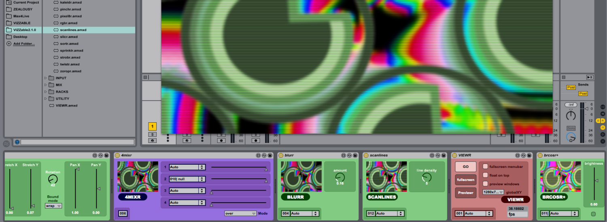

# VIZZable 2
## Modular Video Plugins for Ableton Live

### What is it?
VIZZable allows you to manipulate live and prerecorded video as part of an Ableton Live set.  You can trigger clips, work with live cameras, experiment with effects, and it integrates happily with a broad range of video software using [Syphon](http://syphon.v002.info) and [Spout](http://spout.zeal.co). It was created by Robert Jarvis of [zeal co](http://zeal.co).

If you find VIZZable useful and want to shoot me some bucks you can do so here:

### Minimum Requirements
* Max 6.13 
* Ableton Live 9
* Dedicated graphics highly recommended 

### Download
Download from the releases link above ☝️

### Installation
Place VIZZable folder anywhere on your hard drive.  Drag plugins from
the Ableton browser or your file system, into your live set.

### Support
Community support available through this google group: [http://groups.google.com/group/jitterinmax4live-](
http://groups.google.com/group/jitterinmax4live-)

### Tutorials
[There is a helpful Youtube Playlist here.](https://www.youtube.com/watch?list=PLY9new_oC1k7jl4D-XyD1JR1XuP9WDRG6&v=I9WJr0nvCiQ)

### Tips
All the plugins have help associated in lives built-in help thingo.
Video files should be in quicktime format. A good rule of thumb is to use 
the photoJPEG codec at 74% for the best compromise between quality and performance.

### Thanks
Chris Gough for his fantastic auto-connect system, preview windows and
chain router device. Mike Todd, Fabrizio Poce, Leon Trimble, Ned Rush
and everyone on the JitterInMax4Live group for their knowledge and
enthusiasm. David Avila for his fantastic JS objects used in the
Suprplayr. Stefan Brunner for his keen bug squashing. Wesley Smith for
pouring his brain out on the cycling 74 forums. Sam Tarakajian for his
unbelievably useful [tutorials](http://www.youtube.com/dude837)

This software is released for free.  You are free to edit and/or
redistribute it.  You may not sell it, take credit for my work or
redistribute it with out attribution.  If you edit it and redistribute
it you must let others do the same.  If this software breaks your
computer, it's not my fault.  If it makes you rich and/or famous please
buy me some land in Tasmania.

---
#### changes in 2.1.1
	* fixed blue tint clipplayr issue
	* fixed poor performance of clipplayr on some setups
	* unfroze syphon devices to sidestep possible Max bug

#### changes in 2.1

	* Autoconnect 2.0 implemented.  No longer need to specify an output. (Massive thanks to Chris Gough)
	* Devices renamed and organised in folders.
	* Previewr built in to VIEWR module
	* preview windows optimised
	* fixed a bug where auto-connect would stop working with long chains of fx
	* Help text for all parameters
	* Syphon implementation improved (thanks to cycling74's bug squashing efforts :)
	* Removed recordr device - use syphon recorder on mac or FRAPS etc on Windows.

	INPUT/clipPlayr (new)
		reads movie files dropped into clip slots.  
		Trigger video just as you do audio! 	

	INPUT/ganzgraf (new)
		Port of the popular ganzgraf patch

	INPUT/rackPlayr
		renamed from suprPlayr
		no longer sends error messages when loading an empty cell
		scrub and rate controls added

	INPUT/midibar (new)
		new device similar to midigrid

	INPUT/midigrid
		fixed a bug when running multiple instances
		improved performance especially at higher resolutions

	MIX/chainroutr
		various bug fixes
		select chains with slider
		choose a chain by clicking a chain members' preview window

	MIX/4mixr
		mix modes added
		
	MIX/oper8tr (new)
		blend two images together using different operations

	MIX/chromakeyr (new)
		chromakeying effect

	MIX/alphablendr (new)
		mixes between two video sources, depending on a third mask source

	OUTPUT/syphout (new) (OSX only)
		new plugin, replaces the syphon VIEWR
		automatically generates unique server names so you can run multiple instances
		
	OUTPUT/VIEWR
		selectable output,  useful for feedback effects, syphout etc
		previwr built in and optimised to use its own shared context
		dimensions now save and load with set
		improved performance

	FX/breathr (new)
		Thanks ManySounds on the google group

	FX/brcosr+
		renamed from suprbrcosr

	FX/cropr(new)
		new cropping device

	FX/zoropr
		crop mode
		improvements to the offset parameter
		fixed a bug with the anchor point in clamp mode

	FX/hueshifr
		set default shift to 0.

